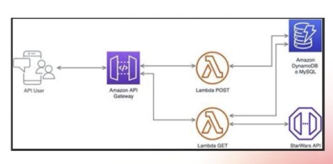

# Proyecto Indra - Personajes Star Wars

Este proyecto proporciona una API para gestionar personajes del universo Star Wars, permitiendo obtener información detallada de cada personaje, así como crear nuevos personajes en una bd local y administrar los registros.

Documento con más información - [lambda](https://www.notion.so/jrocano/Reto-Indra-9bc72c6630f446ae898d07697d8d0b26)



## Tecnologías Utilizadas

- **NestJS**: Utilizado para estructurar el backend y proporcionar un marco de trabajo sólido para la construcción de aplicaciones escalables.
- **AWS Lambda**: Despliegue sin servidor utilizando AWS Lambda para manejar las funciones.
- **Serverless Framework**: Facilita el despliegue y administración de aplicaciones sin servidor.
- **DynamonDb**: Base de datos flexible.
- **Jest**: Utilizado para pruebas unitarias y de integración.
- **Swapi**: Api de datos de personajes, mundos .... de startwars
- **Otros**: Otros paquetes y herramientas pueden ser parte del proyecto, como Swagger para la documentación de la API, etc.

## Configuración AWS CLI

Antes de desplegar el proyecto, asegúrate de configurar AWS CLI con tus credenciales. Puedes hacerlo ejecutando:

```bash
aws configure
```

Luego, ingresa tus credenciales de AWS (ID de clave de acceso, clave de acceso secreta, región y formato de salida).

## Desarrollo Local

Para correr el proyecto localmente, puedes utilizar el plugin Serverless Offline. Primero, asegúrate de tener todas las dependencias instaladas ejecutando:

```bash
yarn install
```

primero debemos realizar el build de la aplicacion:

```bash
yarn run build
```

Luego, puedes iniciar el servidor local con:


```bash
sls offline start
```

Tambien se tiene la opcion de inicializar el servidor de nestjs en local, donde se puede acceder a la documentacion de medante swagger:

```bash
yarn run start:dev
```

## Despliegue

Para desplegar el proyecto en AWS Lambda utilizando el Framework Serverless, primero tiene que realizar el build:

```bash
yarn run build
```

y luego simplemente ejecuta:

```bash
sls deploy --verbose
```

Este comando empaquetará y desplegará tus funciones en AWS Lambda.

[Importante:]() Si por algun motivo tiene un error al momento del despliegue, elimine por completo todo los recursos asociados con el servicio al ejecutar:

```bash
sls remove
```

## Pruebas

Para correr las pruebas unitarias, utiliza el siguiente comando:

```bash
npm test
```

## Stay in touch

- Author - [Jairo Rocano](https://www.linkedin.com/in/jairorocano/)

## License

[MIT licensed](LICENSE).
